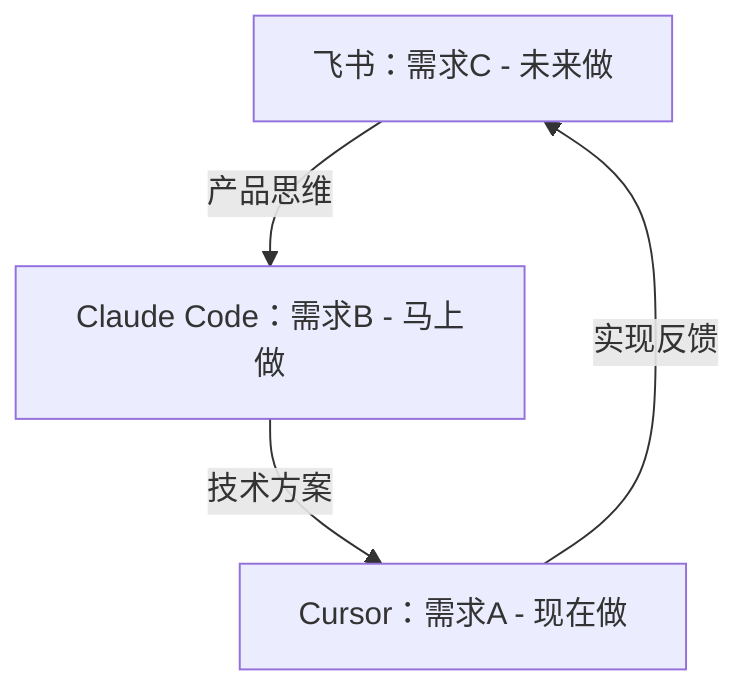

# Vibe Coding：AI时代的10倍效率编程工作流

> 作为独立开发者，如何同时扮演PM、架构师和程序员三个角色？Vibe Coding 工作流让你利用 AI 生成的间隙，在不同抽象层级间无缝切换，实现真正的流水线式开发。

## 📖 目录

1. [核心理念：流水线思维](#一核心理念流水线思维)
2. [基础工作流配置](#二基础工作流配置)
3. [高级多AI协作流程](#三高级多ai协作流程)
4. [实践案例与模板](#四实践案例与模板)
5. [常见问题与最佳实践](#五常见问题与最佳实践)

---

## 一、核心理念：流水线思维

### 🚫 传统线性开发的痛点

很多人的 Vibe Coding 是线性的：写需求 → 等生成 → 报错 → 再等生成。这种模式下，那 120 秒的等待确实是垃圾时间。

### ✅ CPU指令流水线技术借鉴

我的玩法是借鉴 CPU 的 "指令流水线" 技术。作为一名独立开发者，你必须同时是 PM（产品经理）、Architect（架构师）和 Coder（程序员）。

**Vibe Coding 的终极奥义**：利用 AI 生成的间隙，在不同维度的身份间快速切换，而不是在不同项目间切换。

### 🔄 三线并进工作模式



三线共进，可以利用好所有Vibe Coding的时间，还能深度思考。

### ⚠️ 切换原则：纵向而非横向

**错误示范**：Cursor 写项目 A，Claude 聊项目 B，飞书写项目 C。——这会让你大脑"脑裂"（Context Switch Cost 极高），直接宕机。

**正确姿势**：同一个项目，Cursor 写模块 A（现在），Claude 聊模块 B（马上做），飞书定义模块 C（未来做）。

这保持了你对同一个产品的连贯思考，只是处于不同的抽象层级（Abstraction Layers）。这样一来，你的大脑就像流水线一样，永远满载，没有一秒是等待。

---

## 二、基础工作流配置

### 🛠️ 工具准备

1. **飞书文档** - 需求管理和技术文档
2. **Claude Code** - 技术方案讨论
3. **Cursor** - 代码实现执行

### 🎯 新手入门方案

```bash
# 基础三线并行操作
左：飞书文档 - 撰写详细需求文档（产品思维）
中：Claude Code - 讨论技术实现方案（架构思维）
右：Cursor - 执行已确认的编码任务（执行思维）
```

### 📋 标准沟通流程

#### 1. 需求文档标准
- **字数要求**：超过1000字，图文并茂
- **清晰度标准**：「任何人看都没有歧义」
- **格式规范**：结构化文档，包含背景、目标、功能点

#### 2. 首次沟通模板
```
[需求文档内容]

不要急着写代码！先理解需求，给出实现思路，我们先讨论，看还有啥需要我决策的点？ultra think
```

#### 3. 编码前准备
强调让 Claude Code 仔细理解项目结构，尽可能合理地拆分组件、并把组件放到合适的位置。

**新手常见坑**：如果不做强调，Claude Code 可能会写出来单文件很大的组件。

---

## 三、高级多AI协作流程

### 🎖️ 三位AI专家团队配置

| AI工具 | 模型配置 | 角色定位 | 特长 |
|--------|----------|----------|------|
| Codex | GPT-5.1-Codex-Max (Extra High) | 技术架构师 | 架构设计、技术选型 |
| Claude Code | Claude Opus 4.5 (ultrathink) | 文档主笔 | 表达清晰、总结能力强 |
| Antigravity | Gemini 3 Pro (High) | 代码审查员 | 细节把控、风险识别 |

### 🔄 复杂需求处理策略

对于复杂项目，建议采用以下四步法：

1. **深度讨论阶段**：先花两小时讨论需求细节、技术方案
2. **多方评审阶段**：让三位AI专家互相评审方案
3. **文档优先原则**：在完全达成一致之前，不要写任何代码，只写文档
4. **执行标准化**：文档完成后，让任何一位AI执行都可以一步到位

### 📝 详细操作步骤

#### 第1步：需求输入（预计3分钟）
- 使用豆包语音输入法，将需求、大致方案输入飞书文档
- 口述500-1000字左右，语音输入不费力
- 选择飞书文档的原因：格式整理、表格制作、复制分享、修改便捷

#### 第2步：分发需求（预计5分钟）
将需求复制给三位AI专家，要求他们分别：
- a. 用自己的话整理需求（确认理解）
- b. 阅读所有代码后提出技术方案（可行性分析）
- c. 遇到需要决策的内容，提出讨论（风险识别）

#### 第3步：深度讨论（预计60-90分钟）
- 分别回答AI专家提出的问题
- 继续追问是否还有其他需要讨论的点
- 鼓励输出：表格、流程图、ASCII原型图等可视化内容

#### 第4步：方案汇总（预计15分钟）
- 等三位AI专家几乎达成一致后
- 汇总三位专家的方案
- 让Claude Code进行总结，生成Markdown格式文档

#### 第5步：文档标准化（预计30分钟）
文档需要包含：
- **需求部分**：背景、目标、用户故事、功能规格
- **技术方案**：架构图、技术选型、实现步骤
- **质量标准**：详细到「给任何人看，都没有歧义」

#### 第6步：最终审核（预计20分钟）
- 让另外两位AI专家审核完整版文档
- 如有意见，反馈给Claude Code主笔进行修改
- 确保三位专家完全认可方案

---

## 四、实践案例与模板

### 📄 需求文档模板

```markdown
# 需求文档：[项目名称]

## 1. 项目背景
- 业务场景描述
- 现有问题分析
- 解决目标

## 2. 功能需求
### 2.1 核心功能
- 功能点1：详细描述
- 功能点2：详细描述

### 2.2 用户故事
- 作为[用户角色]，我想要[功能]，以便[价值]

## 3. 非功能需求
- 性能要求
- 兼容性要求
- 安全要求

## 4. 验收标准
- 功能验收标准
- 性能验收标准
```

### 💬 沟通用语示例

#### 技术方案讨论模板
```
基于以上需求，我的技术方案如下：

## 架构设计
[详细描述]

## 实现步骤
1. 步骤一
2. 步骤二

## 风险点
- 潜在风险1：解决方案
- 潜在风险2：解决方案

请确认这个方案是否可行，有什么需要调整的地方吗？
```

#### 文档审核反馈模板
```
已审核完整文档，有以下建议：

1. [具体建议1]
2. [具体建议2]

整体方案可行，但建议调整[具体内容]以提高[效果]。
```

### 🖥️ 工作界面布局建议

```
┌─────────────┬─────────────┬─────────────┐
│   左屏      │    中屏     │    右屏     │
│  Codex      │ Claude Code │ Antigravity │
│  架构设计   │  文档编写   │  代码审查   │
│             │             │             │
├─────────────┼─────────────┼─────────────┤
│  飞书文档   │   Cursor    │  浏览器     │
│  需求管理   │  代码编写   │  资料查询   │
└─────────────┴─────────────┴─────────────┘
```

---

## 五、常见问题与最佳实践

### ❓ 常见问题解答

**Q1：如何判断三位AI专家是否达成一致？**
A: 当他们的方案在核心技术栈选择、架构模式上基本一致，仅在实现细节上有差异时，就可以认为达成了一致。

**Q2：如果AI专家意见分歧很大怎么办？**
A: 进一步澄清需求，特别是那些可能产生不同理解的点。必要时可以分阶段实现，先做最小可行版本。

**Q3：如何避免文档过于详细导致时间浪费？**
A: 设定明确的时间边界。标准需求文档控制在1-2小时内完成，技术方案30-60分钟。

**Q4：项目规模较小时如何简化流程？**
A: 可以减少AI专家数量，使用单AI+人工审核的模式，但保持文档优先的原则。

### 🎯 最佳实践总结

1. **始终文档优先**：代码实现前必须完成详细的需求和技术方案文档
2. **保持专注领域**：避免同时处理多个不同类型的项目
3. **建立时间边界**：为每个阶段设定明确的时间限制
4. **迭代优化流程**：根据项目特点调整工作流程细节
5. **保留决策记录**：重要技术决策要记录在案，便于后续回顾

### 📊 效率提升指标

采用Vibe Coding工作流后，预期可以实现：
- **代码质量提升**：减少返工率60%以上
- **开发效率提升**：整体开发时间缩短40%
- **决策质量提升**：技术方案失误率降低70%
- **思维连贯性**：减少上下文切换成本80%

---

> 💡 **记住**：Vibe Coding 不是简单的工具堆砌，而是一种思维方式的转变。当你真正理解了流水线式开发的精髓，你会发现原本的"垃圾时间"都变成了思考的黄金时段。