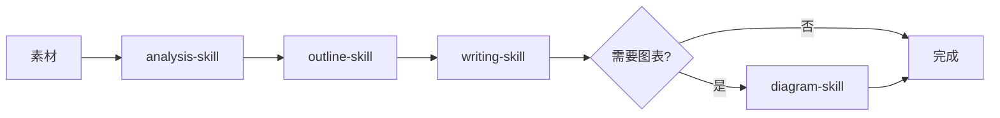

# 多Skills协作的最佳实践

> **三种协作模式、实战案例对比、最佳实践建议** | 让多个Skill配合干活

---

## 核心问题：如何让多个Skills配合干活？

当你的Skill库越来越丰富时，会遇到一个新问题：**如何让多个Skill协同工作？**

**示例场景**:
```
素材 → 分析 → 提纲 → 写作 → SEO优化 → 发布

需要协调: analysis-skill, outline-skill, writing-skill, seo-skill
```

---

## 三种协作模式

### 模式1：主控Skill模式 ⭐推荐

**思路**: 创建一个"指挥Skill"来协调其他Skills

**配置示例**:
```yaml
---
name: content-pipeline
description: |
  内容生产流水线。使用此技能当用户需要:
  1. 素材→完整文章的生产流程
  2. 素材→PPT演示文稿的生产流程

  触发关键词: "内容流水线"、"生产内容"
---

# 内容生产流水线

## 工作流程

当用户提供素材时，依次调用：

1. **analysis-skill** - 分析素材，提取关键信息
2. **outline-skill** - 生成内容大纲
3. **writing-skill** - 基于大纲创作正文
4. **seo-skill** - 优化SEO元素（标题、关键词）

## 输出
完整的内容+发布清单
```

**优势**:
- ✅ 结构化、可复用
- ✅ 一次配置，反复使用
- ✅ 流程标准化

**劣势**:
- ❌ 需要开发成本
- ❌ 灵活性较低

**适用场景**:
- 固定的生产流程（如内容生产、发布流程）
- 复杂的多步骤任务
- 需要频繁执行的流程

**实际案例**:
```yaml
---
name: article-production-line
description: |
  文章生产流水线。使用此技能当用户需要:
  1. 素材→完整文章的自动化生产
  2. 统一质量标准的批量内容生产

  触发关键词: "文章流水线"、"批量生产文章"
---

# 文章生产流水线

## 工作流程

当用户提供素材时，依次调用：

### 1. 素材分析阶段
**使用**: analysis-skill
**输入**: 原始素材（文本、链接、图片）
**输出**: 结构化分析报告
- 核心观点提取
- 目标受众识别
- 关键信息标注

### 2. 大纲生成阶段
**使用**: outline-skill
**输入**: analysis-skill的分析报告
**输出**: 内容大纲
- 标题建议（3-5个选项）
- 章节结构（H2/H3层级）
- 每节核心要点

### 3. 正文创作阶段
**使用**: writing-skill
**输入**: outline-skill的大纲
**输出**: 完整正文
- 符合SEO规范
- 自然语言流畅
- 包含内部链接建议

### 4. SEO优化阶段
**使用**: seo-skill
**输入**: writing-skill的正文
**输出**: SEO优化报告
- 标题评分
- 关键词密度分析
- Meta描述建议
- 内部链接优化建议

### 5. 质量检查阶段
**使用**: proofreading-skill（可选）
**输入**: seo-skill优化后的内容
**输出**: 最终发布版本
- 语法错误检查
- 可读性评分
- AI味检测与降低

## 最终输出
- 📄 完整文章正文（Markdown格式）
- 📊 SEO优化报告
- ✅ 发布前检查清单
- 📝 推荐发布时间
```

---

### 模式2：会话指定模式

**思路**: 在多轮对话中直接指定使用哪些Skill

**示例对话**:
```
用户: 我有一个产品需求，想生成原型图
AI: 好的，我先用ASCII Design Skills快速草拟

[生成ASCII草图]

用户: 可以，现在转成SVG线稿
AI: 使用Wireframe Design Skills生成SVG线稿

[生成SVG线稿]

用户: 选择Claymorphism风格生成高保真稿
AI: 使用ui-ux-pro-max-skill生成最终视觉稿
```

**优势**:
- ✅ 简单直接，无需开发
- ✅ 灵活性极高
- ✅ 适合探索性任务

**劣势**:
- ❌ 每次都要手动指定
- ❌ 依赖用户了解有哪些Skill
- ❌ 难以标准化

**适用场景**:
- 灵活探索（如设计风格尝试）
- 一次性任务
- Skill库较小，用户熟悉所有Skill

**实战案例**:

**案例1: 设计风格探索**
```
# 场景: 尝试不同UI设计风格

用户: 我需要设计一个登录页面
AI: 我使用ASCII Design Skills快速草拟布局

[生成ASCII原型]

用户: 布局可以，现在转成SVG线稿
AI: [调用 wireframe-design-skills]
    生成SVG线稿，保留结构，去除细节

用户: 现在尝试Glassmorphism风格
AI: [调用 ui-ux-pro-max-skill，指定Glassmorphism主题]
    生成毛玻璃效果视觉稿

用户: 再试试Claymorphism风格
AI: [调用 ui-ux-pro-max-skill，指定Claymorphism主题]
    生成3D粘土风格视觉稿

用户: 对比两种风格，我更喜欢Claymorphism
AI: 好的，我帮你导出Claymorphism版本的最终设计
```

**案例2: 数据分析探索**
```
# 场景: 探索不同数据分析方法

用户: 我有一份销售数据，想分析趋势
AI: 我先用基础数据分析

[提供基础统计]

用户: 能不能做时间序列预测？
AI: [调用 time-series-forecast-skill]
    进行ARIMA模型预测

用户: 再试试机器学习方法
AI: [调用 ml-forecast-skill]
    使用随机森林进行预测

用户: 对比两种方法，哪个更准确？
AI: [比较结果]
    ARIMA: MAE=123, RMSE=456
    随机森林: MAE=98, RMSE=321
    推荐: 随机森林
```

---

### 模式3：混合模式 ⭐最佳实践

**思路**: 主控Skill处理固定流程 + 手动指定处理灵活环节

**示例配置**:
```yaml
---
name: content-pipeline-hybrid
description: |
  混合模式内容生产。固定流程: analysis → outline → writing
  灵活环节: 图表、美化、SEO（手动指定）
---

# 内容生产流水线（混合模式）

## 固定流程（自动化）

当用户提供素材时，自动执行：

1. **analysis-skill** - 分析素材
2. **outline-skill** - 生成大纲
3. **writing-skill** - 创作正文

## 灵活环节（手动指定）

完成固定流程后，根据需求手动调用：

- 需要图表 → "使用research-to-diagram skill"
- 需要美化 → "使用formatting skill"
- 需要SEO → "使用seo skill"

## 输出
基础内容 + 可选增强功能
```

**优势**:
- ✅ 平衡了结构和灵活性
- ✅ 核心流程自动化
- ✅ 特殊需求手动介入

**适用场景**:
- 大部分场景（推荐默认方案）

**实战案例**:

**案例1: 内容生产（混合模式）**
```
# 场景: 生产文章，有时需要图表，有时不需要

用户: 我有一个技术主题，想生成文章
AI: [自动执行固定流程]
    [1. analysis-skill] 分析主题，提取关键技术点
    [2. outline-skill] 生成大纲（技术概念→实现原理→实战案例）
    [3. writing-skill] 创作正文

✅ 基础文章完成

用户: 文章不错，但我想加一个架构图
AI: [手动指定]
    "使用research-to-diagram skill生成架构图"

[调用 diagram skill生成SVG架构图]

用户: 现在优化SEO
AI: [手动指定]
    "使用seo skill优化这篇文章"

[调用 seo skill进行优化]

✅ 最终文章: 正文 + 架构图 + SEO优化
```

**案例2: 产品开发（混合模式）**
```
# 场景: 产品开发，核心流程固定，但需要灵活调整

用户: 我想开发一个TODO应用
AI: [自动执行固定流程]
    [1. requirement-skill] 分析需求，列出功能清单
    [2. architecture-skill] 设计技术架构
    [3. prototype-skill] 生成原型图

✅ 基础方案完成

用户: 原型可以，但我想调整设计风格
AI: [手动指定]
    "使用ui-design skill尝试Claymorphism风格"

[调用 ui-design skill]

用户: 还需要写技术文档
AI: [手动指定]
    "使用tech-doc skill生成API文档"

[调用 tech-doc skill]

✅ 最终交付: 方案 + 原型 + 设计 + 文档
```

---

## 实战案例对比

| 场景 | 推荐模式 | 理由 |
|------|---------|------|
| **内容生产流水线** | 主控Skill | 流程固定，需重复执行 |
| **设计风格探索** | 会话指定 | 需要灵活尝试不同风格 |
| **发布流程** | 主控Skill | 步骤标准化，不能出错 |
| **临时分析任务** | 会话指定 | 一次性任务，不值得开发 |
| **复杂项目开发** | 混合模式 | 核心流程自动化+特殊环节手动 |
| **SEO优化流程** | 主控Skill | 关键词分析→内容优化→链接建设 |
| **用户研究流程** | 会话指定 | 每次研究重点不同 |
| **文章生产** | 混合模式 | 基础流程固定，图表/美化灵活 |

---

## 最佳实践建议

### 1. 从简单开始

**初期**（Skill库<10个）:
- 使用会话指定模式
- 手动协调Skills
- 快速验证价值

**中期**（Skill库10-30个）:
- 识别高频流程
- 创建主控Skill
- 标准化核心流程

**成熟期**（Skill库>30个）:
- 混合模式为主
- 核心流程自动化
- 特殊需求手动介入

---

### 2. 记录你的工作流

**识别信号**:
- 某个操作序列重复3次以上 → 考虑创建主控Skill
- 经常同时调用某几个Skills → 考虑组合成新Skill
- 每次都要解释某段流程 → 固化为主控Skill

**示例记录**:
```
# 工作流日志

## 2026-01-15
发现: 每次生产文章都要手动调用: analysis → outline → writing
决策: 创建 content-pipeline 主控Skill

## 2026-01-20
发现: 生产文章后，50%情况需要图表，50%不需要
决策: 使用混合模式，图表环节手动指定

## 2026-01-25
发现: 发布流程每次都要: changelog → 更新README → 决定版本号
决策: 创建 release-pipeline 主控Skill
```

---

### 3. Skill设计要可组合

**单一职责**:
- ✅ 一个Skill做好一件事
- ❌ 一个Skill做所有事

**输入输出标准化**:
- ✅ 明确输入格式
- ✅ 明确输出格式
- ✅ 方便串联

**避免耦合**:
- ✅ Skill之间不直接依赖
- ✅ 通过标准格式传递数据
- ❌ 避免硬编码调用关系

**示例: 可组合的Skills**
```
# ✅ 好的设计

analysis-skill:
  输入: 原始素材（任意格式）
  输出: JSON结构化数据

outline-skill:
  输入: JSON数据
  输出: Markdown大纲

writing-skill:
  输入: Markdown大纲
  输出: Markdown正文

# 优势: 可以任意组合
analysis → outline → writing
outline → writing
writing → seo
analysis → writing
```

```
# ❌ 不好的设计

mega-content-skill:
  包含: analysis + outline + writing + seo
  问题: 无法复用，无法组合
```

---

### 4. 文档化协作流程

**在主控Skill中注明**:
- 调用了哪些子Skill
- 每个Skill的输入输出
- 预期执行时间

**绘制流程图**:


**版本控制**:
- 主控Skill版本号
- 依赖的子Skill版本
- 变更日志

---

## 高级技巧

### 技巧1: 条件分支

**场景**: 根据素材类型选择不同处理流程

**配置**:
```yaml
---
name: smart-content-pipeline
---

# 智能内容生产流水线

## 工作流程

### 1. 素材类型识别
[判断素材类型]

### 2. 分支处理

**如果是技术文章**:
→ analysis-skill(技术) → outline-skill(技术) → writing-skill(技术)

**如果是营销文案**:
→ analysis-skill(营销) → outline-skill(营销) → writing-skill(营销)

**如果是产品需求**:
→ requirement-skill → architecture-skill → prototype-skill

### 3. 通用优化
→ seo-skill → formatting-skill
```

---

### 技巧2: 循环迭代

**场景**: SEO优化需要多轮迭代

**配置**:
```yaml
---
name: seo-iteration-pipeline
---

# SEO迭代优化流水线

## 工作流程

### 第1轮: 初步优化
- keyword-skill (关键词分析)
- content-optimize-skill (内容优化)

### 检查点: SEO评分
[检查SEO评分]

### 分支:
**评分<80分**:
→ 进入第2轮优化
→ meta-optimize-skill (Meta标签优化)
→ link-optimize-skill (内部链接优化)

**评分≥80分**:
→ 完成优化
```

---

### 技巧3: 并行执行

**场景**: 多个独立任务可以同时执行

**配置**:
```yaml
---
name: parallel-content-pipeline
---

# 并行内容生产流水线

## 工作流程

### 阶段1: 素材分析（串行）
→ analysis-skill

### 阶段2: 内容生产（并行）
同时执行:
- writing-skill (写正文)
- diagram-skill (画图表)
- example-skill (生成示例代码)

### 阶段3: 整合输出
→ merge-content-skill (整合所有产出)
```

---

## 常见问题

**Q: 如何选择使用哪种模式？**
A: 参考下面的决策树：

```
需要频繁重复执行？
├─ 是 → 主控Skill模式
└─ 否
    ├─ 需要灵活探索？
    │  ├─ 是 → 会话指定模式
    │  └─ 否 → 混合模式
    └─ 核心流程固定？
       ├─ 是 → 混合模式
       └─ 否 → 会话指定模式
```

**Q: 主控Skill太复杂怎么办？**
A: 拆分成多个小主控Skill，每个负责一个子流程。

**Q: 如何调试Skills协作？**
A: 在主控Skill中添加日志输出，记录每个子Skill的执行结果。

**Q: 子Skill更新后，主控Skill需要更新吗？**
A: 如果输入输出格式不变，则不需要。这是良好设计的标志。

---

## 相关文档

- **[01-核心概念.md](./01-核心概念.md)** - Skills三原则（因需而建、可组合、可迭代）
- **[03-创建方法.md](./03-创建方法.md)** - 如何创建主控Skill
- **[05-实战案例.md](./05-实战案例.md)** - 完整的协作案例
