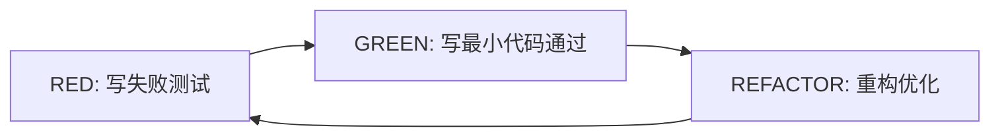

# Superpowers - AI编程工作流系统

**文档类型**: 基础能力 | AI编程辅助
**核心价值**: 让AI编程助手像高级工程师一样工作,而不是缺乏经验的新手
**GitHub**: https://github.com/brilliantoutbreak/superpowers
**Stars**: 22k+
**更新时间**: 2026-01-15

---

## 🎯 核心问题

**当前AI编程助手的痛点**:
- ✅ 能够快速生成代码
- ❌ 不理解软件工程最佳实践
- ❌ 缺乏系统性思考
- ❌ 无法独立完成复杂项目
- **结果**: 像缺乏经验的实习生,而不是高级工程师

**Superpowers的解决方案**:
通过**可组合的技能系统(Skills)**,让AI具备完整的软件开发生命周期能力,实现从"写代码"到"工程化开发"的跨越。

---

## 🧠 四大核心原则

### 1. TDD驱动开发 (Test-Driven Development)

**核心思想**: RED-GREEN-REFACTOR循环



**传统方式 vs Superpowers**:
- ❌ 传统: 先写代码,再写测试(如果写的话)
- ✅ Superpowers: 先写测试定义行为,再写代码实现

**优势**:
- 防止过度工程化
- 每次修改都有测试保护
- 代码即文档(测试用例就是使用说明)

### 2. 系统性胜过临时性

**问题**: AI倾向于快速"修复",导致技术债累积

**Superpowers方式**:
- 每个问题都有系统性解决方案
- 不仅修复表面症状,更找出根本原因
- 使用 **systematic-debugging** 技能:
  1. 症状观察
  2. 问题定位
  3. 假设验证
  4. 根因分析
  5. 系统性修复

### 3. 复杂度降低

**核心理念**: 软件开发的核心挑战是管理复杂度

**Superpowers策略**:
- **模块化**: 将大任务分解为小技能包
- **抽象**: 隐藏实现细节,暴露清晰接口
- **单一职责**: 每个技能只做一件事并做好

**示例**:
- 不是"整个项目重构"
- 而是"重构用户认证模块" → "重构密码验证逻辑" → "重构密码强度检查"

### 4. 证据胜过声明

**原则**: 用测试证明,而不是用语言说服

**实践方式**:
- 每个声明都有可复现的测试
- 性能优化有benchmark数据
- Bug修复有回归测试
- 新功能有验收测试

---

## 🔄 五阶段工作流

### 阶段1: 头脑风暴 (Brainstorming)

**技能**: `brainstorming`

**目的**: 通过苏格拉底式对话明确需求

**对话示例**:
```
🤔 AI: "你想构建什么功能?"
👤 用户: "用户认证系统"
🤔 AI: "具体包括哪些部分?"
👤 用户: "注册、登录、密码重置"
🤔 AI: "需要第三方登录吗?(微信、GitHub等)"
👤 用户: "需要微信登录"
🤔 AI: "密码有什么策略要求?"
👤 用户: "至少8位,包含大小写和数字"
...
```

**输出**: 清晰的需求文档和技术方案

### 阶段2: Worktree隔离 (Worktree Isolation)

**工具**: Git Worktree

**目的**: 为每个功能创建独立的开发分支

**优势**:
- ✅ 并行开发多个功能
- ✅ 隔离实验性代码
- ✅ 保持主分支稳定
- ✅ 快速切换上下文

**命令**:
```bash
git worktree add ../feature-login origin/main
# 在 ../feature-login 中独立开发登录功能
```

### 阶段3: 计划撰写 (Plan Writing)

**技能**: `writing-plans`

**原则**: 每个任务 2-5 分钟可完成

**计划示例**:
```markdown
## 实现密码验证

### 任务1: 创建密码验证函数 (2分钟)
- [ ] 在 `src/auth/validators.js` 创建 `validatePassword` 函数
- [ ] 接收字符串参数,返回布尔值
- [ ] 检查长度>=8,包含大小写和数字

### 任务2: 编写单元测试 (3分钟)
- [ ] 创建 `tests/auth/validators.test.js`
- [ ] 测试用例: 有效密码、过短、无大写、无小写、无数字
```

**粒度原则**:
- ❌ "实现用户系统" (太大,无法估计)
- ✅ "创建用户模型" (可执行)
- ✅ "添加email唯一性约束" (可验证)

### 阶段4: 子代理驱动开发 (Subagent-Driven Development)

**两阶段评审**:

**阶段4.1: 规范评审 (Specification Review)**
- 子代理展示实现计划
- 审查者确认: 是否理解需求?是否遗漏边界情况?
- 通过后开始实现

**阶段4.2: 质量评审 (Quality Review)**
- 代码完成后的全面审查
- 检查点:
  - 是否通过所有测试?
  - 是否遵循最佳实践?
  - 是否需要重构?
  - 文档是否完整?

**评审示例**:
```
🔍 规范评审:
"你计划使用正则验证密码,是否考虑了国际化字符?"
"建议添加 Unicode 字符支持"

✅ 通过规范评审,开始实现...

🔍 质量评审:
"测试覆盖率100%,很好"
"但 `validatePassword` 函数可以提取正则为常量"
"建议重构为 `PASSWORD_PATTERN` 常量"
```

### 阶段5: 收尾 (Finishing)

**决策点**:

**合并 (Merge)**:
- ✅ 所有测试通过
- ✅ 代码评审通过
- ✅ 文档完整
- ✅ 性能达标

**保持PR开放 (Keep PR Open)**:
- ⚠️ 需要更多测试
- ⚠️ 文档不完整
- ⚠️ 需要性能优化

**放弃 (Abandon)**:
- ❌ 技术不可行
- ❌ 成本收益比不合理
- ❌ 需求已变更

---

## 🛠️ 14个核心技能

### 开发流程类

1. **test-driven-development**: TDD开发流程
   - RED: 写失败测试
   - GREEN: 写最小代码通过
   - REFACTOR: 重构优化

2. **systematic-debugging**: 系统化调试
   - 症状观察
   - 问题定位
   - 假设验证
   - 根因分析

3. **brainstorming**: 需求探索
   - 苏格拉底式对话
   - 明确需求边界
   - 技术方案讨论

4. **writing-plans**: 任务分解
   - 2-5分钟粒度
   - 可验证的子任务
   - 依赖关系清晰

### 代码质量类

5. **code-review**: 代码审查
   - 最佳实践检查
   - 安全漏洞识别
   - 性能问题发现

6. **test-automation**: 测试自动化
   - 单元测试
   - 集成测试
   - E2E测试

7. **documentation**: 文档生成
   - API文档
   - 使用示例
   - 架构说明

### 工程实践类

8. **refactoring**: 重构优化
   - 代码结构改进
   - 性能优化
   - 可读性提升

9. **dependency-management**: 依赖管理
   - 包升级策略
   - 安全漏洞修复
   - 版本兼容性

10. **continuous-integration**: CI/CD
    - 自动化测试
    - 自动化部署
    - 质量门禁

### 团队协作类

11. **code-changes**: 变更管理
    - Git工作流
    - 分支策略
    - PR/MR管理

12. **knowledge-sharing**: 知识共享
    - 技术文档
    - 最佳实践总结
    - 经验沉淀

13. **mentoring**: 技术指导
    - 代码评审反馈
    - 技术方案建议
    - 成长路径规划

### 问题解决类

14. **troubleshooting**: 故障排查
    - 日志分析
    - 性能瓶颈定位
    - 生产问题修复

---

## 📦 安装配置

### Claude Code 安装

```bash
# 安装 Superpowers
/plugin marketplace add obra/superpowers-marketplace

# 验证安装
/plugin list
# 应该看到 superpowers 相关技能
```

### 其他IDE支持

**VS Code + Cline**:
- 配置文件: `.clinerules`
- 技能路径: `~/.superpowers/skills/`

**Cursor**:
- 设置: Settings → Cursor → Skills
- 启用技能: 勾选 Superpowers

**JetBrains AI**:
- 插件: Superpowers Integration
- 配置: Settings → Tools → AI Assistant → Skills

---

## 🎬 使用示例

### 示例1: 传统方式 vs Superpowers

**任务**: 添加用户密码重置功能

#### 传统AI助手方式

```
👤 用户: "帮我实现密码重置功能"
🤖 AI: 直接生成200行代码...
✅ 代码完成
❌ 但没有测试
❌ 没有考虑安全风险
❌ 没有错误处理
❌ 没有文档
```

**结果**: 能跑,但充满技术债

#### Superpowers方式

```
👤 用户: "我想添加密码重置功能"

🤖 AI (brainstorming技能):
   "好的,让我们先明确需求:
   1. 密码重置方式?(邮件/短信/手机)
   2. Token有效期多久?
   3. 是否需要频率限制防止滥用?
   ..."

👤 用户: "邮件重置,Token有效期1小时,每用户每小时最多3次"

🤖 AI (writing-plans技能):
   "好的,我制定了以下计划:
   ## 任务1: 创建密码重置数据库模型 (3分钟)
   ## 任务2: 实现Token生成和验证 (5分钟)
   ## 任务3: 创建发送重置邮件API (4分钟)
   ## 任务4: 实现重置密码API (5分钟)
   ## 任务5: 添加频率限制中间件 (3分钟)
   ## 任务6: 编写集成测试 (8分钟)
   ## 任务7: 编写API文档 (2分钟)
   是否开始执行?"

👤 用户: "开始"

🤖 AI (test-driven-development技能):
   "我先写测试..."
   [编写测试用例,验证失败]

🤖 AI: "测试失败了(RED阶段),现在实现功能..."
   [实现代码,测试通过]

🤖 AI: "测试通过(GREEN阶段),现在重构..."
   [优化代码结构,测试依然通过]

🤖 AI (systematic-debugging技能):
   "我发现一个潜在安全问题:
   Token应该使用密码学安全的随机数生成器,
   而不是Math.random()"

[修复安全问题,添加回归测试]

🤖 AI: "所有测试通过,代码审查通过,文档完整"
   "是否合并到主分支?"
```

**结果**:
- ✅ 测试覆盖率100%
- ✅ 安全问题已修复
- ✅ 代码可维护
- ✅ 文档完整

### 示例2: 系统化调试

**场景**: 生产环境偶发性内存泄漏

```
👤 用户: "生产环境偶尔内存泄漏,不知道哪里出问题"

🤖 AI (systematic-debugging技能):

   1. 症状观察:
      "内存增长趋势是什么?"
      "是否有特定操作触发?"
      "多久发生一次?"

   2. 问题定位:
      "让我们添加内存监控:
       - heapdump生成
       - 内存使用日志
       - 对象引用追踪"

   3. 假设验证:
      "假设1: 事件监听器未移除
       验证方法: 添加监听器计数器"

      "假设2: 缓存无限增长
       验证方法: 添加缓存大小监控"

      "假设3: 定时器未清理
       验证方法: 添加定时器追踪"

   4. 根因分析:
      "发现问题: WebSocket连接在用户断开后
       未正确移除消息监听器"

   5. 系统性修复:
      "修复方案:
       1. 添加连接生命周期管理
       2. 实现自动监听器清理
       3. 添加回归测试防止复发"
```

---

## 🎯 何时使用Superpowers

### ✅ 适合使用的场景

1. **复杂功能开发**
   - 多模块交互
   - 需要系统性设计
   - 有性能/安全要求

2. **长期维护项目**
   - 需要高测试覆盖率
   - 团队协作开发
   - 代码质量要求高

3. **学习最佳实践**
   - 了解TDD流程
   - 学习代码审查
   - 掌握系统化调试

4. **重构遗留代码**
   - 需要保证不破坏现有功能
   - 逐步重构,持续验证
   - 建立测试保护网

### ❌ 不适合的场景

1. **快速原型验证**
   - 一次性代码
   - 概念验证
   - 时间压力极大

2. **简单脚本**
   - 几十行的工具脚本
   - 临时数据处理
   - 个人自动化工具

3. **探索性编程**
   - 学习新技术栈
   - 实验性功能
   - 不确定需求的探索

---

## 📚 决策框架

### 使用决策树

```
是否需要长期维护?
├─ 是 → 是否复杂?
│       ├─ 是 → ✅ 使用Superpowers
│       └─ 否 → 部分使用(至少TDD)
└─ 否 → 是否需要质量保证?
        ├─ 是 → 🤔 考虑使用
        └─ 否 → ❌ 不使用,快速实现
```

### 投入产出分析

**Superpowers成本**:
- 学习曲线: 2-3天上手,2周熟练
- 开发速度: 初期慢30-50%,后期快20-30%
- 代码质量: 显著提升
- 维护成本: 降低50%+

**建议**:
- **小型项目(< 1周)**: 可选
- **中型项目(1周-1月)**: 推荐使用
- **大型项目(> 1月)**: 强烈推荐

---

## 🔗 官方资源

### 核心链接

- **GitHub仓库**: https://github.com/brilliantoutbreak/superpowers
- **官方文档**: https://superpowers.docs.brilliantoutbreak.com/
- **视频教程**: https://www.youtube.com/@superpowers-dev
- **Discord社区**: https://discord.gg/superpowers

### 推荐学习路径

1. **入门** (1-2天)
   - 阅读 README
   - 观看 Getting Started 视频
   - 尝试 brainstorming + writing-plans

2. **进阶** (1周)
   - 掌握 TDD 工作流
   - 学习 systematic-debugging
   - 实践完整5阶段流程

3. **熟练** (2-4周)
   - 在实际项目中应用
   - 参与社区讨论
   - 贡献自己的技能

---

## 💡 核心价值总结

### 对个人开发者

**Before**:
- AI快速生成代码
- 充满bug和技术债
- 不敢修改旧代码
- 每次修改都可能引入新问题

**After** (with Superpowers):
- AI系统化开发
- 高测试覆盖率保护
- 重构有安全感
- 持续交付高质量代码

### 对团队协作

**Before**:
- 代码风格不统一
- Review流于形式
- 测试覆盖率低
- 线上bug频繁

**After** (with Superpowers):
- 统一的工程标准
- 系统化代码审查
- 测试驱动质量保证
- 稳定的持续交付

### 对项目质量

**量化指标**:
- Bug密度: ↓ 60-80%
- 测试覆盖率: ↑ 80-95%
- 代码重复率: ↓ 40-60%
- 维护成本: ↓ 50%
- 开发效率(长期): ↑ 20-30%

---

## 🚀 快速开始

### 最小化实践

**只需3步,立即体验Superpowers价值**:

**Step 1: 使用 brainstorming**
```
"我想实现 [功能],帮我梳理一下需求和技术方案"
```

**Step 2: 使用 writing-plans**
```
"将这个功能拆分为2-5分钟的任务"
```

**Step 3: 使用 test-driven-development**
```
"先用TDD方式实现第一个任务"
```

**感受**:
- 需求更清晰
- 任务更可控
- 代码更可靠

---

## 📖 相关文档

### 知识库内部文档

- [00-基础能力/01-Claude-Code环境配置.md](../00-基础能力/01-Claude-Code环境配置.md) - Claude Code基础安装
- [00-基础能力/05-Claude-Code第三方API配置.md](../00-基础能力/05-Claude-Code第三方API配置.md) - API配置方案

### 外部推荐资源

- **Test-Driven Development**: Kent Beck《测试驱动开发》
- **Refactoring**: Martin Fowler《重构:改善既有代码的设计》
- **Clean Code**: Robert C. Martin《代码整洁之道》
- **Working Effectively with Legacy Code**: Michael Feathers《修改代码的艺术》

---

## 🎓 常见问题

### Q1: Superpowers 会让开发变慢吗?

**A**: 初期会慢30-50%,因为需要:
- 学习技能使用
- 编写测试
- 系统化思考

但**长期来看**会快20-30%,因为:
- 减少调试时间
- 减少返工
- 更容易维护和扩展

### Q2: 必须使用所有14个技能吗?

**A**: 不必须。推荐渐进式采用:

**阶段1**: 必备技能
- brainstorming (需求明确)
- writing-plans (任务分解)
- test-driven-development (质量保证)

**阶段2**: 进阶技能
- systematic-debugging (问题解决)
- code-review (质量提升)

**阶段3**: 专业技能
- 根据项目需要选择性使用

### Q3: 与传统TDD有什么区别?

**A**: Superpowers的TDD:

1. **AI辅助**: AI自动生成测试代码
2. **可组合**: 与其他技能无缝配合
3. **系统化**: 强调整个开发流程,而不仅是测试
4. **证据驱动**: 用测试证明设计决策

**传统TDD**: 手动编写测试,缺乏系统化流程

### Q4: 可以只用于新代码吗?

**A**: 可以,但Superpowers特别适合重构旧代码:

**策略**:
1. 先为新功能使用Superpowers
2. 修改旧代码时,先写测试保护
3. 逐步用Superpowers方式重构
4. 最终全项目迁移

### Q5: 是否支持所有编程语言?

**A**: 理论支持所有语言,但成熟度不同:

**最佳支持**:
- Python (pytest)
- JavaScript/TypeScript (Jest/Vitest)
- Go (testing package)

**良好支持**:
- Java (JUnit)
- C# (xUnit/NUnit)
- Ruby (RSpec)

**社区贡献**: 可以贡献自己语言的技能包

---

**文档版本**: v1.0
**创建日期**: 2026-01-15
**最后更新**: 2026-01-15
**状态**: ✅ 完成

**下一步行动**:
1. 在Claude Code中安装Superpowers: `/plugin marketplace add obra/superpowers-marketplace`
2. 尝试使用brainstorming技能梳理下一个功能需求
3. 实践一次完整的TDD开发流程
4. 评估是否在现有项目中引入Superpowers工作流
