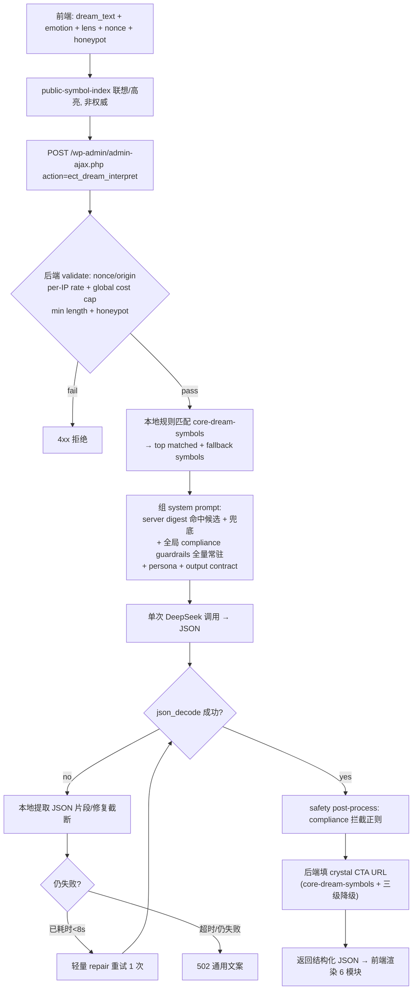

# AI Dream Interpreter - 数据层与工具设计

> 日期: 2026-07-09
> 状态: 架构主稿 v3(实现可运行性审查后, 可进入 PRD)
> URL: `/tools/ai-dream-interpreter/`
> 页面类型: 独立工具页, 不进入文章批量生产
> 变更: v2 落地 C1/C2/M1-M5; **v3 落地实现层 15 条**(P1 单次后端调用 / P2 digest 分层 / P3 IP / P4 反滥用 / P5 timeout / T1-T5 收紧 / E1-E5)+ 2 调整(E4 不默认 re-prompt / E2 合规全量常驻)

## 0. 核心决策

AI Dream Interpreter 采用 **AI 实时生成 + 数据层双池 + 合规模板护栏 + 水晶电商闭环**, 技术架构 **复用皇冠 AI 塔模式**, 数据流 **后端单次调用**(前端不直连 LLM)。

1. 用户输入梦境文本, 由 DeepSeek **后端单次调用**实时生成结构化 JSON。前端不直连 LLM, 不做两次 LLM 调用(成本/延迟)。
2. **LLM 架构(C1)**: 复用皇冠 AI 塔 — WP `admin-ajax` 后端代理 + DeepSeek + `.env` 密钥(不暴露前端) + base64 前端 + server digest 注入。详见 §6。
3. **数据层双池(C2)**:
   - **主匹配池 = `core-dream-symbols.json`**(工具专用, 50-100 核心梦象 Subject, MVP 必建)
   - **补充池 = `dreams-knowledge.json`**(内容线宗教 Lens 长尾池, 仅做 Lens 语境补充 / 合规标记参考; **非 MVP 主匹配池**)
4. **digest 分层(P2)**: `public-symbol-index.json`(前端, 轻量联想/高亮, 非权威)+ server digest(后端 base64, 注入 DeepSeek)。前端 hint 不信, 后端权威重匹配。
5. **隐私边界(E5)**: MVP **不存梦境原文 / 不做 dream log / 不写输入日志**; 只 transient 存限流计数。DeepSeek 数据政策为开发前核验硬门(§16)。
6. `dreams-knowledge.json` 当前是 stub 骨架(160 对象 143 Lens, 核心梦象 Subject 缺失), 不作最终内容来源。

一句话: **前端提交文本 → 后端规则匹配 + 单次 DeepSeek + 填 CTA → 结构化 JSON 回前端渲染; core-dream-symbols 主池 + 实时生成跑 MVP, 内容线解耦。**

---

## 1. 为什么不是检索式解梦

### 1.1 竞品形态

| 竞品 | 主形态 | 可学点 | 不学点 |
|---|---|---|---|
| dreaminterpreter.ai | 单轮输入 -> AI 解读 + Art + Map | 任务清晰, 工具词占位强 | UGC 字典和 region 页 SEO 质量低 |
| sleepfy.ai | 单轮输入 -> 模块化 Jungian 输出 | 4000 字输入, 方法论透明页, 模块化结果 | 订阅模型单薄, 无实物闭环 |
| dreamybot | 对话式 AI + Memory | 追问、自我觉察、Dream Log | 强制对话会增加首轮摩擦 |
| dreamslytic | 表单 + 宗教视角选择 | Religious Perspective selector | 单段长文输出、广告体验弱 |

结论: 工具页应满足 "do intent"。文章库和字典页是 SEO 辅助, 不是工具答案主来源。

### 1.2 当前数据状态(实测 2026-07-09)

`04-内容生产/dreams/_shared/dreams-knowledge.json`(761KB):

- 160 对象: page_type **Lens 143 / Subject 16 / Emotion 1**; 核心梦象 Subject 缺失(`teeth=0` `drown=0` `naked=0` `marry=0` `driving=0`; snake/falling/flying/death 仅 Lens 变体)
- priority P0 10 / P1 35 / P2 115; 全部 `brief/content/publication_ready:false`; psychology/spiritual `not_yet_sourced`; `summary_status:stub`

**定性**: 内容线宗教/灵性 Lens 长尾 SEO 池, **非工具核心梦象匹配池**。需新建 `core-dream-symbols.json` 作主池。

---

## 2. 产品定位

### 2.1 工具目标

输入梦境, 快速得到: Summary / 关键梦象识别(匹配 core-dream-symbols)/ 心理学反思 / 灵性视角 / 合规水晶推荐 / journaling 建议 / Shop 入口。

### 2.2 差异化

解梦 -> 梦境能量 -> 水晶 ritual -> Shop; AI interpretation + crystal recommendation; 合规温和不诊断不预言不裁决; 文章矩阵与工具互导流但不互相阻塞。

---

## 3. 信息架构

### 3.1 页面结构

1. Hero 工具区: H1 "AI Dream Interpreter" + 副标题(Free / Anonymous / Crystal-Infused Insights)+ 梦境输入框(4000 字上限)+ "Interpret My Dream" 主按钮 + **honeypot 隐藏字段**(§6.6)。
2. 可选上下文: 情绪(calm/afraid/confused/sad/excited/intense); **视角: balanced / psychological / spiritual / crystal-focused**(M5: **去掉 religious-sensitive**, 宗教敏感由命中数据触发); 语言 English first。
3. 结果区 6 模块(§9): Summary / Symbols / Psychological / Spiritual / Crystal Match / Reflection + Related/Shop CTA。
4. **Loading skeleton(m4)**: 3-12 秒进度反馈("Reading the symbols… / Weaving your reflection…"), 仿 sleepfy; 前端 15s soft timeout 显示"请重试"。
5. SEO 支撑区: How We Interpret Dreams / reliability / FAQ-PAA accordion / Safety & privacy note。

### 3.2 结果模块数据来源

| 模块 | 来源 |
|---|---|
| Summary / Psychological / Spiritual / Reflection | DeepSeek 实时生成 |
| Symbols | DeepSeek 抽取 + 后端 core-dream-symbols 权威匹配 |
| Crystal Match | 后端从 core-dream-symbols crystal_mapping 取 + 三级降级填 CTA(E1: LLM 只出 name+why, **CTA URL 后端填**) |
| Shop CTA | core-dream-symbols `shop_url`(§10) |

---

## 4. 数据层双池 + digest 分层架构(C2 + P2)

### 4.1 双池

| 池 | 文件 | 角色 | MVP |
|---|---|---|---|
| **主匹配池** | `07-互动工具/ai-dream-interpreter/data/core-dream-symbols.json`(新建) | symbol match / psychology skeleton / crystal mapping / compliance trigger / **server digest 源** | **必建** |
| **补充池** | `04-内容生产/dreams/_shared/dreams-knowledge.json` | 命中宗教 Lens 长尾时提供敏感标记 + 二级语境 | 可选 |

### 4.2 core-dream-symbols.json 规格

**规模**: MVP 先建 ~40 最高量核心梦象。

**category enum 锁 8 类(T5 归一)**: `animal / body / scene / emotion / spiritual / disaster / object / person`。`dream_type`(recurring/lucid/nightmare/prophetic/visitation)是**独立字段**, 不进 category。跨类梦象定主类: 自然灾害(tornado/drowning/earthquake)→ disaster; 人造场景(intruder/test/late)→ scene; 关系情绪(ex/cheating)→ emotion。

**MVP 必含核心梦象(归一后)**:

- **body**: teeth falling out, hair falling out, being pregnant
- **animal**: snake, cat, dog, bear, spider, frog, cockroach, rat, bird, fish, horse
- **scene**: being chased, falling, flying, swimming, driving, can't move(sleep paralysis), being lost, being late, test/exam, naked in public, intruder
- **emotion**: ex partner, cheating partner, being fired
- **spiritual**: prophetic dream, visitation
- **disaster**: drowning, tornado, earthquake, fire
- **object**: money, water, blood, wedding/marriage, funeral
- **person**: dead friend/relative, stranger, baby
- **dream_type(独立字段, 非category)**: recurring, lucid, nightmare, prophetic, visitation

**单个对象 schema**:

```json
{
  "id": "sym_teeth",
  "symbol": "teeth falling out",
  "category": "body",
  "dream_type": null,
  "keywords": ["teeth", "tooth", "falling out", "losing teeth", "crumbling teeth"],
  "psychology_skeleton": "Reflective frame: transition, loss of control, communication anxiety, self-image shift. NOT diagnosis.",
  "crystal_mapping": {
    "primary": {"slug": "blue-lace-agate-meaning", "shop_url": "/product-category/blue-lace-agate-crystals/", "why": "throat/self-expression"},
    "variant_fear": {"slug": "smoky-quartz-meaning", "shop_url": "/product-category/smoky-quartz-crystals/", "why": "grounding after anxiety"}
  },
  "compliance_trigger": {
    "not_medical_advice": true,
    "not_mental_health_diagnosis": true,
    "not_a_religious_ruling": true,
    "religious_sensitivity": false
  },
  "shop_url_validated": false
}
```

### 4.3 digest 分层(P2)

core-dream-symbols.json 派生**两份**, 职责分离:

| 产物 | 位置 | 内容 | 用途 | 喂 LLM? |
|---|---|---|---|---|
| **public-symbol-index.json** | 前端(base64) | symbol + keywords + category(轻量) | 输入时联想/高亮展示 | **否**(非权威, 仅展示) |
| **server digest** | 后端(PHP 常量 base64) | 命中候选 symbol + psychology_skeleton + crystal_mapping + compliance_trigger | 注入 DeepSeek system prompt | 是 |

**E2 裁剪规则**: server digest 只注入**命中候选 top 5 + 高频兜底 ~10**(控 token); 但 **全局 compliance guardrails / 禁止表达 / crystal 不治疗不保证 / 宗教不裁决 §7-§8 全量常驻 prompt, 不裁**——未命中梦象反而更易越界, 合规规则必须常驻。

**P2 信任边界**: 前端 matched_symbols 仅 hint, 后端必须用 core-dream-symbols 权威重匹配, 不信前端。

### 4.4 dreams-knowledge.json 实际角色(降级)

仅命中宗教 Lens 长尾时读 `spiritual.religious_sensitivity` 触发谨慎措辞; `internal_links.shop_candidates` 作 CTA 候选(标 needs_link_mapping, 上线前验)。**不可作最终解读/宗教事实/文章内容来源**。

### 4.5 未来增强(内容线完成后)

Evidence RAG / Brief RAG / Article RAG, 只在 source-reviewed / publication_ready 后参与, 非阻塞。

---

## 5. 核心流程(P1 重画 — 后端单次调用)



**关键**: 全程**一次 DeepSeek 调用**; symbol 抽取由后端规则匹配 + DeepSeek 在单次生成中一并完成(不单独第二次调 LLM); CTA URL 后端填(E1); JSON 失败不降级纯文本(E4)。

---

## 6. LLM 调用架构(C1 — 复用皇冠 AI 塔)

> **范本**: `07-互动工具/ai-tarot-chat/build/snippet.php`(已上线)。套用架构, 替换 action/digest/output。

### 6.1 架构总览

| 组件 | 皇冠 AI 塔(验证) | Dream 工具(复用) |
|---|---|---|
| 后端端点 | ajax `ect_ai_chat`(`wp_ajax`+`wp_ajax_nopriv`) | **`ect_dream_interpret`**(双注册) |
| 路径 | `/wp-admin/admin-ajax.php` | 同 |
| 模型 | DeepSeek `deepseek-chat`(OpenAI 兼容) | 同 |
| 密钥 | `EAC_DEEPSEEK_KEY`(OS env / `ABSPATH/.env`) | **复用同一 key** |
| digest | 22 牌 base64 ascii 注入 | server digest(core-dream-symbols 派生) |
| 前端 | base64 JS `atob+eval` | 同(crown standard) |

**密钥安全**: key 只在 PHP 常量, 从不暴露前端; 前端只 POST ajax, PHP 代理转发 DeepSeek。

### 6.2 调用流程(P1 定死 8 步)

```
前端: dream_text + emotion + lens + nonce + honeypot
  (public-symbol-index 仅联想/高亮, 不参与权威判断)
  ↓ POST ajax
后端:
  1. validate: nonce / same-origin / per-IP rate / global cost cap / min input(≥10) / honeypot
  2. 本地规则匹配 core-dream-symbols(keywords fuzzy)
  3. 选 top matched symbols + fallback symbols
  4. 组 system prompt: server digest(命中+兜底) + 全局 compliance(全量常驻) + persona + output contract
  5. 单次 DeepSeek 调用(response_format json_object, max_tokens 1800, temp 0.7)
  6. json_decode + safety post-process(compliance 拦截正则)
  7. 后端填 crystal CTA URL(core-dream-symbols + 三级降级)
  8. 返回结构化 JSON → 前端渲染
```

### 6.3 digest 分层 + 合规常驻(P2/E2)

- **public-symbol-index.json**(前端 base64): symbol+keywords+category, 联想/高亮, 非权威, 不喂 LLM。
- **server digest**(后端 base64 ascii): 命中候选 top5 + 高频兜底10 的 symbol+skeleton+crystal+compliance, 注入 system prompt。
- **全局 compliance guardrails(§7-§8)全量常驻 system prompt, 不随 digest 裁剪**。

### 6.4 Output JSON contract(E1: CTA 后端填)

DeepSeek `response_format:json_object` 输出, **`cta_url` 不由 LLM 生成**(防幻觉死链/钓鱼), 后端从 core-dream-symbols 查 + 三级降级填:

```json
{
  "summary": "...",
  "symbols": [{"name":"snake","meaning":"...","confidence":"medium"}],
  "psychological_lens": "...",
  "spiritual_lens": "...",
  "crystal_matches": [{"name":"Black Tourmaline","why":"..."}],
  "reflection_prompt": "...",
  "safety_note": "..."
}
```
后端 post-process 时给每个 crystal_matches 项补 `cta_url`(LLM 只出 name+why)。max_tokens 1800, temp 0.7。

### 6.5 限流 / IP / timeout / JSON 兜底 / 错误

**IP 来源优先级(P3)**: `CF-Connecting-IP → X-Forwarded-For 首个可信 IP → REMOTE_ADDR`(配置可信代理段, 防全站共用代理 IP 被误封 / 被绕过)。

**timeout(P5 — 实时失败, 不退避)**:
- 用户实时请求**不做 10s 退避重试**(退避只用于后台批量)。
- 前端 **15s soft timeout**(显示"请重试") + 后端 **25s hard timeout**。
- 上游 DeepSeek 429 直接失败返回通用文案。
- P95 <15s 因此可达(§14)。

**JSON 兜底(E4 用户调整)**:
- `json_decode` 失败 → 尝试本地提取 JSON 片段 / 修复常见截断(补 `}` 等)。
- 仍失败 → **仅当已耗时 <8s** 才允许一次轻量 "repair JSON" 重试(同 prompt + "return valid JSON only")。
- 超时或仍失败 → 502 通用文案。**不降级纯文本 summary**(前端 6 模块依赖结构化, 纯文本会制造第二套渲染逻辑)。

**错误返回(P5)**: 429/502 只返回通用文案 + 状态码, **不泄露上游 DeepSeek 细节**(model/error body/headers)。

### 6.6 反滥用硬门(P4 — 5 道, nopriv 必开)

1. **wp nonce + same-origin check**(`rest_nonce` / `check_ajax_referer`)。
2. **per-IP daily cap**(transient, 15 次)。
3. **global daily cost cap**(站点级 option, 如 500 次/天, 防 token 烧爆, 优先级高于 per-IP)。
4. **minimum input length**(≥10 字符, 拒短输入刷接口)。
5. **honeypot 隐藏字段**(前端隐藏 input, 填了 = bot, 直接拒)。
6. 输入硬上限 4000 字符(mb_substr)。

### 6.7 隐私边界(E5)

- **MVP 不存梦境原文**: 不落库, 不做用户 dream log, 不把输入写文件日志。
- 只 transient 存限流计数(IP+日期 hash, 非原文)。
- **DeepSeek API 数据政策**: 标为**开发前核验硬门**(§16)——确认其是否将输入用于训练; 若用于训练则需切换模型或加显著隐私声明。
- **页面隐私文案**先写明站内处理原则: "Your dream text is used only to generate this interpretation in the moment. We do not store it, and you don't need an account."

---

## 7. Prompt 设计

### 7.1 System guardrails(全量常驻, 不裁)

- You are not a clinician, therapist, religious authority, or prophet.
- Interpret dreams as reflective, symbolic, and personal.
- Do not diagnose mental illness.
- Do not claim a dream predicts death, illness, pregnancy, betrayal, divine command, or guaranteed future events.
- For any religious framing, describe as cultural/interpretive context only; never issue a ruling.
- Crystals are ritual/reflection tools, not treatments, cures, guarantees, or protection promises.

### 7.2 Runtime context(T4 修正: compliance 按真实字段, 移除 internal-only 标记)

```json
{
  "dream_text": "...",
  "user_context": {"emotion": "afraid", "preferred_lens": "balanced"},
  "matched_symbols": [{"symbol":"snake","category":"animal","crystal_candidates":["black-tourmaline-meaning"]}],
  "compliance": {
    "not_medical_advice": true,
    "not_mental_health_diagnosis": true,
    "not_a_religious_ruling": true,
    "no_third_party_coverage_inference_claim": true,
    "dream_dictionary_prefix_forbidden": true,
    "religious_sensitivity": false
  }
}
```

> ⚠️ **T4**: `requires_human_review` 是**后端内部标记**(控制日志复核 flag), **不传 LLM**(防它输出"需人工审核")。`religious_sensitivity` 由命中梦象/视角触发(M5), 非用户选。删除 v1 自造的 `no_deterministic_prediction`。

### 7.3 Output contract

见 §6.4。

---

## 8. 合规模板护栏(全量常驻 system prompt, E2)

### 8.1 禁止表达(后端 post-process 正则拦截)

"This dream means you will..." / "God is telling you..." / "sign you are sick..." / "crystal will cure/protect/guarantee..." / "Islam says you must..." / "Bible definitively means..." / "You have trauma/depression/anxiety because..."

### 8.2 推荐表达

"This may reflect..." / "One possible reading is..." / "In a reflective spiritual lens..." / "If distressing, consider a qualified professional" / "Crystals as a tactile cue for journaling, not treatment."

### 8.3 敏感主题降级

| 主题 | 处理 |
|---|---|
| death/killing/violence | 抽象为 fear/change/threat; 不预测死亡 |
| pregnancy | 不做怀孕判断; 只谈 creation/change/anxiety/hope |
| religious dreams | 不裁决; 建议咨询 qualified faith guide |
| nightmare/PTSD | 给 support resource |
| self-harm | 安全建议 + 紧急资源, 不做普通解梦 |

---

## 9. Crystal Match(M1 — 8 类 category 重建, 与 §4.2 归一对齐)

不依赖 dreams-knowledge 的 amethyst/quartz 占位; 随 core-dream-symbols 的 8 类 category 映射。

### 9.1 category → crystal 主映射

| category | 主水晶 | 意图 |
|---|---|---|
| animal | Black Tourmaline, Labradorite | 转化/保护/直觉 |
| body | Blue Lace Agate, Aquamarine | 表达/喉咙 |
| scene | Black Tourmaline, Smoky Quartz | 安全/接地 |
| emotion | Rose Quartz, Moonstone | 关系/情绪疗愈 |
| spiritual | Amethyst, Labradorite, Selenite | 第三眼/灵性 |
| disaster | Smoky Quartz, Hematite | 接地/稳定 |
| object | Citrine, Carnelian | 丰盛/旅程 |
| person | Rose Quartz, Moonstone | 疗愈/释放 |

### 9.2 情绪变体重排(叠加在 category 主水晶上)

fear/chase/nightmare → +Smoky Quartz/Black Tourmaline; grief → +Amethyst/Smoky Quartz; lucid/prophetic → +Amethyst/Labradorite/Moonstone; relationship/ex → +Rose Quartz/Moonstone。

### 9.3 Shop URL

走 core-dream-symbols `shop_url`, 后端填 + 三级降级(§10)。

---

## 10. 转化设计(M2 — Shop CTA MVP 硬门)

### 10.1 CTA 三级降级

1. **L1** `/product-category/{stone}-crystals/` — curl 200
2. **L2** L1 失败 → `/shop/?s={stone}`
3. **L3** 搜索空 → `/crystals-for-dreams/` Hub, 终极 `/product-category/healing-jewelry/`

### 10.2 上线前批量验证(硬门, 阻塞上线)

脚本遍历 core-dream-symbols 所有 `shop_url`:
- **L1**: curl HTTP 200。
- **L2(T3 修正)**: 搜索页不只验 200——**验证 DOM 含商品结果**(WoodMart `.wd-products` 存在或 product count>0); 空结果 200 视为失败, 降级 L3。
- 产出 `cta-by-slug.json`(对标塔罗 `_cta-by-slug.json`)。未通过的 stone 不得用 L1。

### 10.3 文案

不硬广("will stop nightmares"/"guarantees")。用软 CTA("tactile cue for journaling"/"gentle ritual object"/"calming bedside reminder")。

---

## 11. WordPress 部署(M4)

### 11.1 文件结构

```text
07-互动工具/ai-dream-interpreter/
  PRD.md
  generate.js
  build/
    snippet.php               # ajax handler(ect_dream_interpret)
    ai-dream-interpreter.html # 主页(wp:html + base64)
    gen-snippet.js            # Code Snippets REST 注册
  data/
    core-dream-symbols.json   # 主匹配池(源)
    public-symbol-index.json  # 前端派生(轻量, 联想/高亮)
    server-dream-digest.json  # 后端派生(注入 DeepSeek, 或内置 PHP 常量)
    crystal-fallback-map.json # 8 类 category → crystal
    cta-by-slug.json          # Shop URL 验证结果
```

### 11.2 wp:html + base64(crown standard, memory `wp-html-block-js-base64`)

前端 = public-symbol-index(数据)+ ajax JS(含 `&&`/比较)+ 渲染。**wp_kses 翻车组合**, 必须 base64:
- 可执行 JS: `<script type="text/plain" id="edi-app">{base64}</script>` + loader `atob→eval`
- public-symbol-index: ascii base64(非 CJK)
- 参考皇冠 `ai-tarot-chat.html` line 206-211

### 11.3 部署流程

1. `generate.js` 生成 HTML + 派生 public-symbol-index/server-digest
2. `snippet.php` 经 Code Snippets REST 注册(路由 `/wp-json/code-snippets/v1/snippets`; **curl 非 urllib**, 避 Imunify360 403; 创建前 GET 查重防双 active)
3. `.env` 已有 `DEEPSEEK_API_KEY`(复用皇冠)
4. 建 page `/tools/ai-dream-interpreter/`, 嵌 wp:html
5. 批量验 Shop URL(§10.2) + 30 梦象测试集(§14)
6. TKD 补全(rank_math updateMeta, **必带 UA** curl)
7. mega menu + Keep exploring 联动(snippet19)

---

## 12. SEO 要点

目标词(1D-补充 §9): `ai dream interpreter`(P0, KD22, slug 完美)/ `dream analyzer`(P0)/ `ai dream interpretation`(P1)。

- Title: `AI Dream Interpreter: Free Dream Analyzer & Crystal Insights | Earthward`
- Meta: `Interpret your dream with a free AI dream analyzer, then explore symbolic meanings, reflection prompts, and personalized crystal recommendations.`
- H1: `AI Dream Interpreter`; URL: `/tools/ai-dream-interpreter/`

FAQ(m3 修正, 去宗教诱导):
1. Can AI interpret dreams? 2. Is this free? 3. Can ChatGPT interpret dreams? 4. Are dream meanings always accurate? 5. Can crystals help with dream recall? 6. **Does this replace professional advice?**(替代原"Is this religious dream interpretation?", 避免给 Google 宗教意图信号)。

避开: `free dream interpretation`/`dream meaning ai`(AIO 锁)/ `dream reader`(TTS 噪声)/ `dream decoder`(撞 ChatGPT/Wiki)。

---

## 13. MVP 范围

### 13.1 Must Have

1. `/tools/ai-dream-interpreter/` 独立页 + 4000 字输入 + 免注册首轮解读。
2. **Loading skeleton**(15s soft timeout)。
3. 结果 6 模块。
4. `core-dream-symbols.json`(MVP ~40)匹配。
5. DeepSeek 后端代理(§6) + crystal cards + Shop CTA(三级降级)。
6. 安全免责 + 隐私提示(§6.7)。
7. FAQ SEO 区。
8. **反滥用 5 道**(§6.6) + **Shop URL 批量验证通过**(§10.2)。

### 13.2 Should Have

可选 follow-up / 结果存 journal 文本 / Related dream pages / `/crystals-for-dreams/` Hub 联动 / 方法论区块。

### 13.3 Not MVP

AI dream art / Dreamer Map / UGC 字典 / 多语言 SEO / 订阅 Pro / 强制登录 Dream Journal / 在世真人 Persona。

---

## 14. 验收标准(m5 — 可测)

1. **30 梦象测试集**(T1 补足): teeth/snake/falling/flying/chase/water/death/ex/pregnancy/money/cat/blood/fire/spider/tornado/naked/drowning/marriage/driving/bear/dog/baby/lost/test/late/can't-move/dead-friend/prophetic/lucid/**funeral**。
2. **命中率拆分(T2)**: 核心 symbol 命中率 **≥80%** **且** fallback **≤20%**(fallback 超标 = core-dream-symbols 覆盖不足, 触发扩池而非放水)。
3. **结构化 JSON 100% 合法**(§6.4 schema; 失败走 §6.5 兜底, **不接受纯文本降级**)。
4. **宗教主题 0 ruling**: snake-spiritual/pregnant-biblical/dead-relative 测试, §8.1 拦截正则 0 命中。
5. **医疗/预言表达 100% 拦截**: "will I die/am I sick/God says" 测试集。
6. **水晶推荐 0 治疗/保证表述**。
7. **Shop URL 100% 200 或降级 L2/L3, 0 死链**(L2 验 DOM 含商品)。
8. **延迟 P95 <15s**(§6.5: 25s hard timeout, 实时不退避)。
9. **限流生效**: 单 IP 第 16 次 429; 站点级 cost cap 达上限全站 429。
10. **反滥用**: nonce 失败/无 origin/honeypot 填写/min<10 均被拒。
11. **隐私**: 验证无梦境原文落库/日志(transient 仅计数 hash)。
12. **SEO 文案独立承接 `ai dream interpreter` 意图**(TKD+H1+FAQ)。

---

## 15. 与其他文档边界

| 问题 | 权威文档 |
|---|---|
| URL / 导航 / 是否做工具页 | `02-网站规划/2A-网站结构.md`, `页面决策表.md` |
| Dream 文章类型 | `03-内容策略/解梦文章类型框架.md` |
| 数据层 schema / 图片策略 | `03-内容策略/Dream数据层与图片策略.md` |
| 竞品工具证据 | `01-竞品分析/1D-解梦深度拆解/补充-工具功能交互深挖.md` |
| LLM 架构范本 | `07-互动工具/ai-tarot-chat/build/snippet.php`(皇冠 AI 塔) |
| 生产状态 | `04-内容生产/dreams/workflow-status-2026-07-09.md`, `qa/*.json` |
| 本工具最终产品决策 | 本文档 |

---

## 16. 当前待办(v3)

1. **生成 `PRD.md`**(基于本文档, 可执行级)。
2. **新建 `core-dream-symbols.json`**(MVP ~40 梦象, §4.2 schema + 8 类 category 归一)。
3. **【开发前核验硬门 E5】核验 DeepSeek API 数据政策**(是否将输入用于训练; 决定模型选型 / 隐私声明措辞)。
4. 派生 `public-symbol-index.json`(前端)+ `server-dream-digest`(后端)。
5. 从皇冠 `snippet.php` 派生 dream snippet(action `ect_dream_interpret`, 复用 key, 加 §6.6 反滥用 5 道)。
6. system prompt + 全局 compliance 常驻 + output contract。
7. 批量 curl 验证 shop_url(§10.2, L1 200 + L2 DOM 含商品)。
8. UI: 输入区 / loading skeleton / 6 模块 / crystal cards / FAQ。
9. generate.js 生成 wp:html + base64。
10. 30 梦象测试集 + §14 验收 12 条跑通。

> v1 "是否接 LLM" / v2 待办已闭环。v3 新增 E5 DeepSeek 数据政策核验硬门。

---

*v3 完成于 2026-07-09 | v2(C1/C2/Major)+ v3(实现层 15 条 + 2 调整)落地 | 下游: core-dream-symbols 构建 → PRD → 开发*
