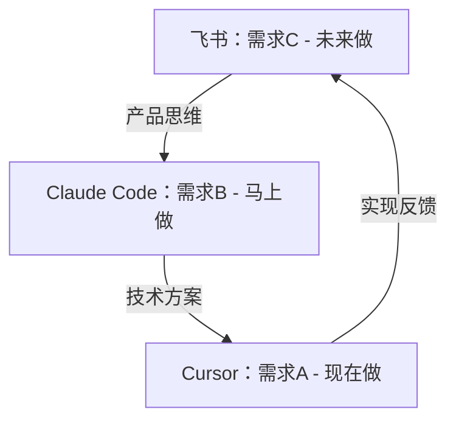

# Vibe Coding：AI时代的10倍效率编程工作流

> 作为独立开发者，如何同时扮演PM、架构师和程序员三个角色？Vibe Coding 工作流让你利用 AI 生成的间隙，在不同抽象层级间无缝切换，实现真正的流水线式开发。

---

## 🌟 核心前提：成长型思维

> **"超级个体可以培养，不是只能筛选"**

### 固定型思维 vs 成长型思维

**固定型思维**：
- 超级个体是天生的，只能筛选，不能培养
- "我没有技术背景，学不会AI开发"
- "多线工作太累了，我做不到"

**成长型思维**：
- 王侯将相宁有种乎，通过努力可以达成
- AI拉平了技术门槛，人人都可以成为超级个体
- 技能可以叠加：AI把所有技能拉到80分 + 你的长板到95分

**实践验证**：
- 零基础成长周期：6-12个月
- 包括夕阳传统行业、零互联网基础的背景
- 单人月收入3万美金+（真实案例）

### 技能叠加策略

**传统模式**（补短板）：
- 你要成为全栈工程师（前端+后端+测试+运维）
- 学习周期：5-10年
- 容易焦虑：永远有短板要补

**AI时代模式**（叠加长板）：
- AI把所有技能拉到**80分**
- 你只需要一项**95分**的长板能力
- 组队不是补短板，而是叠加长板

**示例**：
```
你的长板：产品思维（95分）
+ AI：编程能力（80分）
+ AI：设计能力（80分）
+ AI：运营能力（80分）
= 超级个体（全栈能力）
```

### Vibe-Coding是成长型思维的实践

**为什么需要Vibe-Coding？**
- ✅ AI让你可以同时扮演多个角色（PM+架构师+程序员）
- ✅ 流水线思维让你在AI生成间隙保持思考
- ✅ 多线并进不是天赋，是可以训练的思维方式

**从固定型到成长型**：
```
固定型思维："我只能做一件事"
    ↓
成长型思维："我可以同时做3件事，只要方法对"
    ↓
Vibe-Coding："利用AI间隙，三线并进"
```

---

## 🌟 AI时代的认知转变：知道 = 会了

> **"AI时代有一个很反常识的东西：以前你知道≠你会了，但现在，你知道=会了"**
>
> —— Aster, MEMOS反思笔记

### 传统时代的认知逻辑

**旧公式**:
```
你知道 ≠ 你会了
↓
需要：行动 → 实践 → 反馈 → 矫正
↓
理论指导实践 → 实践修正理论 → 再实践
```

**旧时代的门槛**:
- ✅ 要求：行动力强、执行力强
- ✅ 需要：大量时间试错、迭代、积累经验
- ✅ 结果：知道到做到之间有巨大的gap

### AI时代的新逻辑

**新公式**:
```
你知道 = 你会了
↓
流程：你知道 + 跟AI说 + AI做出来 = 你会了
↓
（尤其是已经被验证过的方案，复刻成功率99%）
```

**AI时代的突破**:
- ✅ **行动的阻力被AI极大磨平**
- ✅ **实践成本趋近于零**
- ✅ **迭代周期从月缩短到分钟**

### Vibe安装：AI时代的工作方式

**什么是Vibe安装？**
- 把需求/链接直接丢给AI
- AI读取、理解、执行
- 你只需要验收结果

**真实案例**:
```
看到一篇Claude Code技巧文章
↓
直接把文章链接丢给AI
↓
AI："让我读取这个链接，了解需要配置什么功能"
↓
AI自动配置完成
↓
完成！
```

**社交媒体反馈**:
- Jiachen: "直接vibe安装，掌握了vibe coding的精髓"
- ItsZoeFox: "AI掌握的编程知识比你多，所以让AI去思考和执行"

### 新门槛：了解AI能力边界

**AI时代不需要**:
- ❌ 强大的行动力（AI替你执行）
- ❌ 深厚的技术背景（AI知道得比你多）
- ❌ 大量试错时间（AI已经验证过）

**AI时代需要**:
- ✅ **多了解AI能做啥/不能做啥的边界**
- ✅ **见多识广**（知道各种可能性）
- ✅ **提问能力**（清晰表达需求）

### 实战案例：Claude Code技能仪表盘

**场景**: 你看到一个很酷的Claude Code可视化仪表盘

**旧时代思维**:
- "哇，好厉害，但我做不出来"
- "这个需要学前端框架、数据可视化..."
- **结果：放弃**

**AI时代思维**:
- "哇，好厉害，我也要一个"
- 把需求丢给AI："帮我做一个Claude Code技能仪表盘"
- AI自动生成：大概率更好看、更炫酷、更符合你的审美
- **结果：10分钟拥有**

### 吟游诗人模式：见多识广的价值

**为什么做个"见多识广的吟游诗人"挺好？**

1. **多看多了解各种可能性**
   - 浏览GitHub上的AI项目
   - 阅读技术博客和教程
   - 关注AI工具的发展

2. **知道了就能让AI实现**
   - 看到：别人用AI做了X
   - 想到：我也可以做Y
   - 执行：把需求丢给AI
   - 结果：Y做出来了

3. **复刻成功率99%**
   - 前提：已经被验证可行的方案
   - 流程：你知道 → AI执行 → 你会了
   - 周期：从小时缩短到分钟

### 从Vibe安装到Vibe Coding

**一脉相承的思维模式**:

| 场景 | Vibe安装 | Vibe Coding |
|------|---------|-------------|
| **本质** | 把需求丢给AI | 把任务丢给AI |
| **AI角色** | 执行者 | 思考者+执行者 |
| **你的角色** | 提出需求 | 产品经理+架构师 |
| **门槛** | 知道就能做 | 理解就能指导 |

**共同点**:
- ✅ 不需要自己动手
- ✅ AI的知识远超你
- ✅ 知道=会了

**不同点**:
- Vibe安装：一次性配置（如Hooks、Plugins）
- Vibe Coding：持续开发流程（如三线并进）

### 核心启示

**AI时代，魔法时代**:
- 你知道的事情，立刻就能实现
- 行动力不再是瓶颈
- 想象力才是边界

**Vibe-Coding的终极目标**:
- 不是让你成为更快的程序员
- 而是让你成为**产品思维的超级个体**
- AI负责所有执行，你负责所有思考

---

## 📖 目录

1. [核心理念：流水线思维](#一核心理念流水线思维)
2. [基础工作流配置](#二基础工作流配置)
3. [高级多AI协作流程](#三高级多ai协作流程)
4. [实践案例与模板](#四实践案例与模板)
5. [常见问题与最佳实践](#五常见问题与最佳实践)

---

## 一、核心理念：流水线思维

### 🚫 传统线性开发的痛点

很多人的 Vibe Coding 是线性的：写需求 → 等生成 → 报错 → 再等生成。这种模式下，那 120 秒的等待确实是垃圾时间。

### ✅ CPU指令流水线技术借鉴

我的玩法是借鉴 CPU 的 "指令流水线" 技术。作为一名独立开发者，你必须同时是 PM（产品经理）、Architect（架构师）和 Coder（程序员）。

**Vibe Coding 的终极奥义**：利用 AI 生成的间隙，在不同维度的身份间快速切换，而不是在不同项目间切换。

### 🔄 三线并进工作模式



三线共进，可以利用好所有Vibe Coding的时间，还能深度思考。

### ⚠️ 切换原则：纵向而非横向

**错误示范**：Cursor 写项目 A，Claude 聊项目 B，飞书写项目 C。——这会让你大脑"脑裂"（Context Switch Cost 极高），直接宕机。

**正确姿势**：同一个项目，Cursor 写模块 A（现在），Claude 聊模块 B（马上做），飞书定义模块 C（未来做）。

这保持了你对同一个产品的连贯思考，只是处于不同的抽象层级（Abstraction Layers）。这样一来，你的大脑就像流水线一样，永远满载，没有一秒是等待。

---

## 二、基础工作流配置

### 🛠️ 工具准备

1. **飞书文档** - 需求管理和技术文档
2. **Claude Code** - 技术方案讨论
3. **Cursor** - 代码实现执行

### 🎯 新手入门方案

```bash
# 基础三线并行操作
左：飞书文档 - 撰写详细需求文档（产品思维）
中：Claude Code - 讨论技术实现方案（架构思维）
右：Cursor - 执行已确认的编码任务（执行思维）
```

### 📋 标准沟通流程

#### 1. 需求文档标准
- **字数要求**：超过1000字，图文并茂
- **清晰度标准**：「任何人看都没有歧义」
- **格式规范**：结构化文档，包含背景、目标、功能点

#### 2. 首次沟通模板
```
[需求文档内容]

不要急着写代码！先理解需求，给出实现思路，我们先讨论，看还有啥需要我决策的点？ultra think
```

#### 3. 编码前准备
强调让 Claude Code 仔细理解项目结构，尽可能合理地拆分组件、并把组件放到合适的位置。

**新手常见坑**：如果不做强调，Claude Code 可能会写出来单文件很大的组件。

---

## 三、高级多AI协作流程

### 🎖️ 三位AI专家团队配置

| AI工具 | 模型配置 | 角色定位 | 特长 |
|--------|----------|----------|------|
| Codex | GPT-5.1-Codex-Max (Extra High) | 技术架构师 | 架构设计、技术选型 |
| Claude Code | Claude Opus 4.5 (ultrathink) | 文档主笔 | 表达清晰、总结能力强 |
| Antigravity | Gemini 3 Pro (High) | 代码审查员 | 细节把控、风险识别 |

### 🔄 复杂需求处理策略

对于复杂项目，建议采用以下四步法：

1. **深度讨论阶段**：先花两小时讨论需求细节、技术方案
2. **多方评审阶段**：让三位AI专家互相评审方案
3. **文档优先原则**：在完全达成一致之前，不要写任何代码，只写文档
4. **执行标准化**：文档完成后，让任何一位AI执行都可以一步到位

### 📝 详细操作步骤

#### 第1步：需求输入（预计3分钟）
- 使用豆包语音输入法，将需求、大致方案输入飞书文档
- 口述500-1000字左右，语音输入不费力
- 选择飞书文档的原因：格式整理、表格制作、复制分享、修改便捷

#### 第2步：分发需求（预计5分钟）
将需求复制给三位AI专家，要求他们分别：
- a. 用自己的话整理需求（确认理解）
- b. 阅读所有代码后提出技术方案（可行性分析）
- c. 遇到需要决策的内容，提出讨论（风险识别）

#### 第3步：深度讨论（预计60-90分钟）
- 分别回答AI专家提出的问题
- 继续追问是否还有其他需要讨论的点
- 鼓励输出：表格、流程图、ASCII原型图等可视化内容

#### 第4步：方案汇总（预计15分钟）
- 等三位AI专家几乎达成一致后
- 汇总三位专家的方案
- 让Claude Code进行总结，生成Markdown格式文档

#### 第5步：文档标准化（预计30分钟）
文档需要包含：
- **需求部分**：背景、目标、用户故事、功能规格
- **技术方案**：架构图、技术选型、实现步骤
- **质量标准**：详细到「给任何人看，都没有歧义」

#### 第6步：最终审核（预计20分钟）
- 让另外两位AI专家审核完整版文档
- 如有意见，反馈给Claude Code主笔进行修改
- 确保三位专家完全认可方案

---

## 四、实践案例与模板

### 📄 需求文档模板（唯一真源）

> 为避免“同一模板在多个文件里复制粘贴，越改越不一致”，本仓库采用“feature-dev 文档内统一维护模板”的方式。

- Spec 模板：见 `02-单AI开发-feature-dev开发流程.md` → “阶段0：写Spec”
- DoD 清单：见 `02-单AI开发-feature-dev开发流程.md` → “完成定义（DoD）”
- 最小 PRD：见 `应用产品开发需求发现指南.md` → “2小时产物包 / PRD一页纸”

（如果你需要快速开工：先写 Spec，再用 feature-dev 推进到发布）

### 💬 沟通用语示例

#### 技术方案讨论模板
```
基于以上需求，我的技术方案如下：

## 架构设计
[详细描述]

## 实现步骤
1. 步骤一
2. 步骤二

## 风险点
- 潜在风险1：解决方案
- 潜在风险2：解决方案

请确认这个方案是否可行，有什么需要调整的地方吗？
```

#### 文档审核反馈模板
```
已审核完整文档，有以下建议：

1. [具体建议1]
2. [具体建议2]

整体方案可行，但建议调整[具体内容]以提高[效果]。
```

### 🖥️ 工作界面布局建议

```
┌─────────────┬─────────────┬─────────────┐
│   左屏      │    中屏     │    右屏     │
│  Codex      │ Claude Code │ Antigravity │
│  架构设计   │  文档编写   │  代码审查   │
│             │             │             │
├─────────────┼─────────────┼─────────────┤
│  飞书文档   │   Cursor    │  浏览器     │
│  需求管理   │  代码编写   │  资料查询   │
└─────────────┴─────────────┴─────────────┘
```

---

## 五、常见问题与最佳实践

### ❓ 常见问题解答

**Q1：如何判断三位AI专家是否达成一致？**
A: 当他们的方案在核心技术栈选择、架构模式上基本一致，仅在实现细节上有差异时，就可以认为达成了一致。

**Q2：如果AI专家意见分歧很大怎么办？**
A: 进一步澄清需求，特别是那些可能产生不同理解的点。必要时可以分阶段实现，先做最小可行版本。

**Q3：如何避免文档过于详细导致时间浪费？**
A: 设定明确的时间边界。标准需求文档控制在1-2小时内完成，技术方案30-60分钟。

**Q4：项目规模较小时如何简化流程？**
A: 可以减少AI专家数量，使用单AI+人工审核的模式，但保持文档优先的原则。

### 🎯 最佳实践总结

1. **始终文档优先**：代码实现前必须完成详细的需求和技术方案文档
2. **保持专注领域**：避免同时处理多个不同类型的项目
3. **建立时间边界**：为每个阶段设定明确的时间限制
4. **迭代优化流程**：根据项目特点调整工作流程细节
5. **保留决策记录**：重要技术决策要记录在案，便于后续回顾

### 📊 效率提升指标

采用Vibe Coding工作流后，预期可以实现：
- **代码质量提升**：减少返工率60%以上
- **开发效率提升**：整体开发时间缩短40%
- **决策质量提升**：技术方案失误率降低70%
- **思维连贯性**：减少上下文切换成本80%

---

## 六、进阶：与其他AI开发方式的关系

> **Vibe-Coding是思维方式（Level 1），可以与所有工具方法组合使用**

### 🔗 Vibe-Coding + Schaltwerk = 终极组合

**核心思想**：三线并进的思维 + 自动隔离的工具 = 10-15倍效率

| 维度 | 纯Vibe-Coding | Vibe-Coding + Schaltwerk |
|------|--------------|------------------------|
| 思维模式 | 三线并进 | 三线并进 |
| 工具支撑 | 手动管理 | 自动隔离 |
| 并行数量 | 3个 | 10个 |
| 效率提升 | 3-5倍 | **10-15倍** |

**详细教程**：→ [03-多AI协同-Schaltwerk工具.md](./03-多AI协同-Schaltwerk工具.md)

---

### 🔗 Vibe-Coding vs 自动化流水线

**核心区别**：
- **Vibe-Coding** = 思维方式（教你怎么思考）
- **自动化流水线** = 技术系统（教你怎么实现）

| 维度 | Vibe-Coding | 自动化流水线 |
|------|------------|-------------|
| 本质 | 方法论 | 工具链 |
| 并行方式 | 3个AI同时 | 1个AI串行151个 |
| 人工参与 | 高（持续工作） | 低（无人值守） |
| 适用场景 | 3-10个多样功能 | 50-151个重复任务 |

**它们是互补关系，不是替代关系！**

**详细对比**：→ [05-全景对比-4种AI开发方式.md](./05-全景对比-4种AI开发方式.md)

---

## 七、相关文档

### 开发方式导航
- [AI开发方式快速导航](./README.md) - 根据任务数量选择方案
- [4种AI开发方式全景对比](./05-全景对比-4种AI开发方式.md) - 三维对比（思维、并行、参与度）

### 具体实现文档
- [02-单AI开发-feature-dev开发流程.md](./02-单AI开发-feature-dev开发流程.md) - 7阶段SOP
- [03-多AI协同-Schaltwerk工具.md](./03-多AI协同-Schaltwerk工具.md) - Schaltwerk完整教程
- [04-自动化流水线-CSV+MCP系统.md](./04-自动化流水线-CSV+MCP系统.md) - CSV+MCP系统

### 工具配置
- [Claude Code安装指南](../../00-基础能力/01-Claude-Code安装配置.md)

---

> 💡 **记住**：Vibe Coding 不是简单的工具堆砌，而是一种思维方式的转变。当你真正理解了流水线式开发的精髓，你会发现原本的"垃圾时间"都变成了思考的黄金时段。